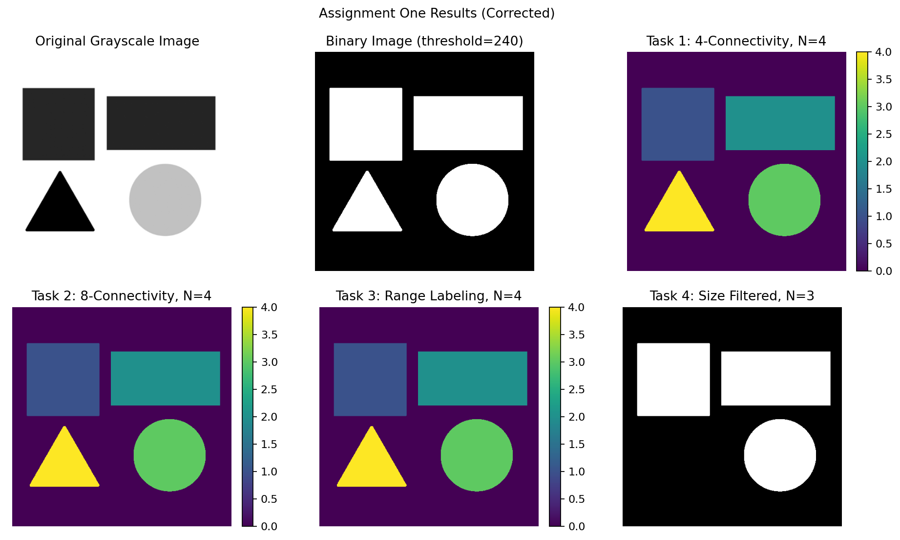

# Digital Image Processing — Connected Component Analysis

A MATLAB coursework project implementing **connected-component labeling and size filtering manually** using direct pixel processing and a queue-based flood-fill algorithm.

The project compares **4-connectivity** and **8-connectivity**, performs labeling over a selected grayscale intensity range, and removes components below a configurable minimum size.

## Results

For the included test image and the coursework parameters:

| Task | Configuration | Result |
|---|---|---|
| 1 | 4-connectivity | 4 components |
| 2 | 8-connectivity | 4 components |
| 3 | Intensity range `[0, 240]` | 4 components |
| 4 | Minimum size `15000` | 3 components remain |

### Combined Result



## Main Concepts

- Manual RGB-to-grayscale conversion
- Binary thresholding
- Connected-component labeling
- 4-neighbor and 8-neighbor connectivity
- Queue-based flood fill
- Intensity-range segmentation
- Component-size filtering
- Image-result visualization

## Repository Structure

```text
Digital-Image-Processing-MATLAB/
├── src/
│   └── connected_component_analysis.m
├── data/
│   └── input_image.png
├── results/
│   ├── assignment_results.png
│   ├── binary_image.png
│   ├── filtered_binary.png
│   ├── input_grayscale.png
│   ├── labels_4_connectivity.png
│   ├── labels_8_connectivity.png
│   └── labels_intensity_range.png
├── docs/
│   └── assignment-report.md
├── .gitattributes
├── .gitignore
└── README.md
```

## Parameters

```matlab
binaryThreshold = 240;
minIntensity = 0;
maxIntensity = 240;
minimumComponentSize = 15000;
```

These values were selected for the provided coursework image.

## How to Run

1. Clone or download the repository.
2. Open MATLAB.
3. Open `src/connected_component_analysis.m`.
4. Run the script.

The script automatically reads `data/input_image.png` and writes generated images to `results/`.

## Implementation Note

The assignment's labeling and size-filtering operations are implemented manually. Functions that directly solve connected-component labeling or component-size filtering are intentionally not used.

## Technologies

- MATLAB
- Digital Image Processing
- Image Segmentation
- Flood-Fill / Breadth-First Search
