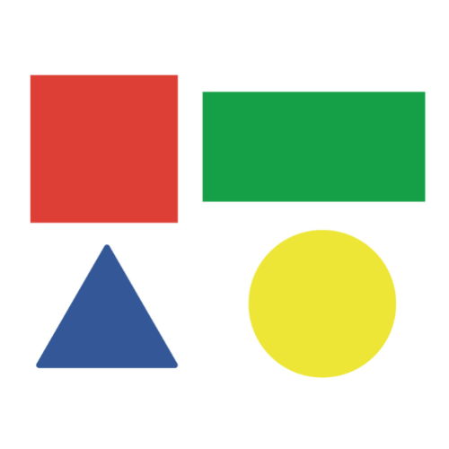

# Assignment Report — Component Labeling and Size Filtering

## Objective

The goal is to implement connected-component labeling and size filtering manually in MATLAB using direct pixel manipulation rather than built-in labeling or size-filtering functions.

## Input Image

The supplied image contains four separated shapes on a light background:

- square
- rectangle
- triangle
- circle

## Selected Parameters

| Parameter | Value |
|---|---:|
| Binary threshold | 240 |
| Intensity-range minimum | 0 |
| Intensity-range maximum | 240 |
| Minimum retained component size | 15000 pixels |

## Method

### 1. Grayscale Conversion

For RGB input, grayscale intensity is computed manually using the weighted formula:

`Gray = 0.2989R + 0.5870G + 0.1140B`

### 2. Binary Thresholding

Pixels darker than the threshold are treated as foreground pixels.

### 3. Connected-Component Labeling

A queue-based flood-fill algorithm visits each foreground component. The neighbor set changes according to the requested connectivity:

- **4-connectivity:** up, down, left, right
- **8-connectivity:** the four direct neighbors plus the four diagonals

### 4. Intensity-Range Labeling

A binary mask is created from pixels whose grayscale values fall within `[0, 240]`, then the same manual component-labeling algorithm is applied.

### 5. Size Filtering

Each connected component is measured. Components smaller than `15000` pixels are removed.

## Verified Results

| Task | Result | Component sizes |
|---|---|---|
| 4-connectivity | 4 components | 27552, 30627, 21355, 11653 |
| 8-connectivity | 4 components | 27552, 30627, 21355, 11653 |
| Range labeling | 4 components | 27555, 30627, 21355, 11672 |
| Size filtering | 3 components | 27552, 30627, 21355 |

The smallest component is removed by the minimum-size filter, while the three larger objects remain.

## Output

## Conclusion

The project demonstrates manual connected-component analysis using both 4- and 8-connectivity, intensity-based segmentation, and size-based filtering. The supplied image produces four components before filtering and three after the minimum-size rule is applied.
